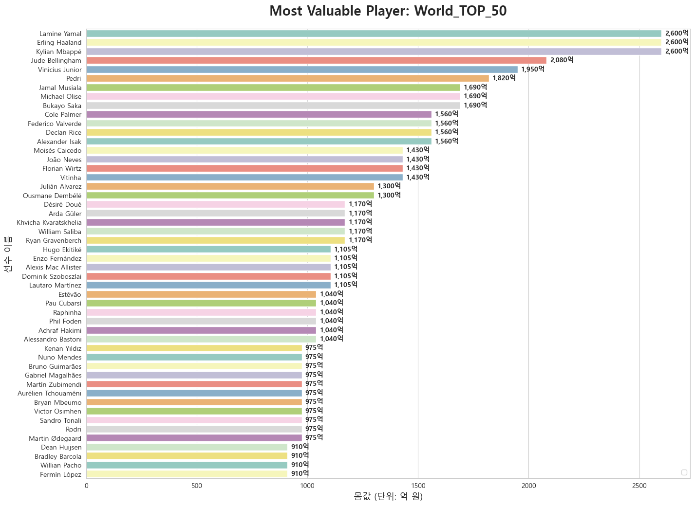
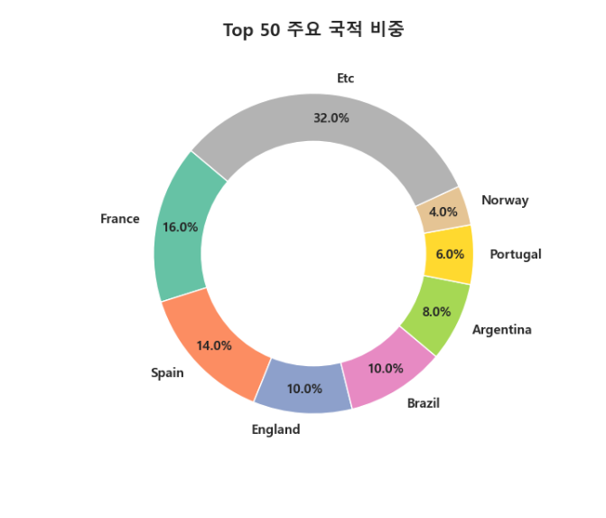
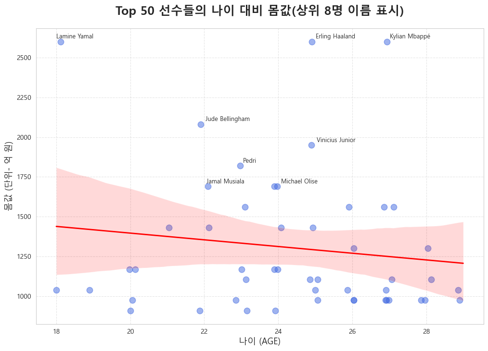

# ⚽ Soccer Lens

**데이터라는 렌즈(Lens)로 축구의 이면을 분석합니다.** `Soccer Lens`는 팀의 성적, 선수의 가치, 전술적 특징을 데이터 추출과 시각화를 통해 객체적으로 바라보는 프로젝트입니다.

## 🔍 무엇을 분석하나요?

* **팀(Team):** 잘나가는 팀의 이유와 부진한 팀의 원인 분석
* **선수(Player):** 팀의 에이스나 다크호스 선수의 데이터 기반 평가
* **전술(Tactics):** 세트피스 및 특정 팀의 전술적 특징 포착

## 🛠 사용 기술

* **Data:** `Pandas` (데이터 추출 및 정제)
* **Visualization:** `Matplotlib`, `Seaborn` (데이터 시각화)
* **Image Processing:** `OpenCV` (이미지 및 전술 분석 보조)

# 📈 분석 사례

## 사례_1

### [Ligue 1] RC 랑스(Lens)의 득점 효율 분석

현재 리그앙 1위를 기록 중인 **RC 랑스**의 성적 비결을 득점 효율성 데이터를 통해 분석했습니다.

* 단순 슈팅 횟수가 아닌, 기회 대비 실제 득점으로 이어지는 '결정력' 지표 확인
* 타 상위권 팀과 하위권팀과의 효율성 비교 시각화
* 상세정보 - https://www.notion.so/1-2e75e4cc37e381efb628e1e86e62da31

---
## 사례_2

### [Market Value] 전 세계 선수 가치 분석 (Top 50)

전 세계 축구 선수 중 시장 가치가 가장 높은 50명을 대상으로 가치 분포와 연령대별 트렌드를 분석했습니다.

#### 1. 몸값 상위 선수 및 클럽 분포 (Top 50)
* 가장 높은 가치를 지닌 선수들과 그들이 소속된 클럽을 분석하여,<br>
  현재 이적 시장의 핵심 자산이 어디에 집중되어 있는지 시각화했습니다.


#### 2. Top 50 주요 국적 비중
* Top 50 선수들의 국적 데이터를 분석하여,<br>
  전 세계 축구 인재의 주요 공급처와 국가별 강세를 파악했습니다. 도넛 차트를 통해 시각적 직관성을 높였습니다.


#### 3. 나이 대비 몸값 상관관계 (Aging Curve)
* 상위 8인의 데이터를 바탕으로 나이와 몸값의 상관관계를 분석했습니다.<br>
  텍스트 겹침을 최소화하여 각 선수의 데이터 포인트를 명확히 식별할 수 있도록 구성했습니다.


---

## 🚀 실행 방법

```bash
# 레포지토리 클론
git clone https://github.com/사용자이름/soccer_lens.git

# 관련 라이브러리 설치
pip install pandas matplotlib seaborn opencv-python

```
